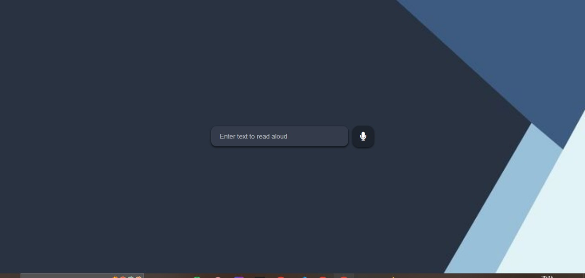

# Web Text-to-Speech Converter
## App Screenshot




A minimalist web application that converts text to speech using the browser's built-in Web Speech API.

## Features

- Clean, modern UI with glassmorphism effect
- Responsive design that works on all devices
- Instant text-to-speech conversion
- No external dependencies (pure HTML/CSS/JS)
- Microphone button with hover effects
- Beautiful background image

## Technologies Used

- HTML5
- CSS3 (with modern features like flexbox)
- JavaScript Web Speech API
- Font Awesome for icons

## How to Use

1. Open `index.html` in any modern browser
2. Type your text in the input field
3. Click the microphone button to hear the text spoken aloud

## Installation

No installation required! Simply clone the repository and open the HTML file:

```bash
git clone https://github.com/mohammedXdev/text-to-speech.git
cd text-to-speech
open index.html
```
Customization
Changing Styles
Modify style.css to:

Change the background image (line 2)

Adjust colors and transparency effects

Modify button styles

Changing Functionality
Edit script.js to:

Add different voices

Change speech rate/pitch

Add additional controls

Browser Support
The Web Speech API works in most modern browsers:

Chrome 33+

Edge 14+

Firefox 49+

Safari 7+ (with prefix)

License
This project is open source and available under the MIT License.

Contributing
Contributions are welcome! Please:

Fork the repository

Create your feature branch

Commit your changes

Push to the branch

Open a pull request


